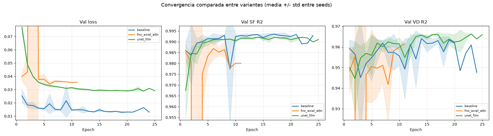
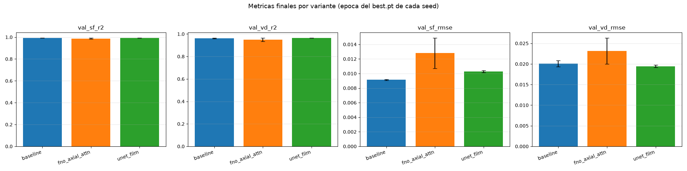

# Informe de resultados — Campaña `fno_vs_unet_vs_attn`

## 1. Resumen ejecutivo

Se compararon tres arquitecturas para predecir la evolución espacio-temporal del Factor de
Seguridad (SF) y la Deformación Volumétrica (VD) bajo inyección de CO₂: la línea base
**FNO+FiLM** (`baseline`), una variante **U-Net con condicionamiento FiLM temporal**
(`unet_film`) y una variante **FNO + atención espacial axial** (`fno_axial_attn`). Cada
arquitectura se entrenó con 3 semillas independientes sobre el mismo split de datos. La línea base FNO+FiLM sigue siendo la referencia de mejor desempeño; `unet_film` alcanza una **paridad** de desempeño (no una mejora, pero tampoco una degradación relevante) con una arquitectura estructuralmente distinta; `fno_axial_attn` **no** cumplió su criterio de éxito predefinido y mostró mayor varianza entre semillas.

| Variante | val_sf_r2 | val_vd_r2 | Veredicto |
|---|---|---|---|
| `baseline` | 0.9937 ± 0.0001 | 0.9626 ± 0.0028 | referencia |
| `unet_film` | 0.9920 ± 0.0002 | 0.9650 ± 0.0010 | equivalente a la línea base |
| `fno_axial_attn` | 0.9874 ± 0.0042 | 0.9498 ± 0.0141 | no cumple el criterio predefinido |

---

## 2. Contexto del problema

El modelo predice la evolución temporal del **Factor de Seguridad (SF)** y la
**Deformación Volumétrica (VD)** en una grilla 2D por capa de un reservorio depletado
sometido a **inyección de CO₂** (almacenamiento geológico de carbono, CCS). SF y VD son
indicadores geomecánicos: SF cuantifica el margen de estabilidad frente a falla del
reservorio (valores más bajos, mayor riesgo) y VD cuantifica la deformación volumétrica
inducida por el cambio de presión de poro.

La entrada del modelo combina **propiedades estáticas** del reservorio por capa
(permeabilidad, porosidad, cohesión, AFI, profundidad) con **series temporales de
inyección** de los pozos TENE-1 y TENE-2, y produce la evolución de SF y VD a lo largo de
61 pasos temporales. Este tipo de modelo sustituye simulaciones numéricas costosas (CMG)
por una inferencia rápida, útil para exploración de escenarios de inyección y evaluación
preliminar de riesgo geomecánico.

---

## 3. Arquitecturas comparadas

Las tres variantes comparten el mismo condicionamiento temporal (embedding de paso
temporal + MLP sobre `[inyección TENE-1, inyección TENE-2, profundidad]` inyectado vía
FiLM) y el mismo régimen de datos/split/pérdida — **solo cambia el núcleo de la
arquitectura**, para que la comparación aísle ese único factor.

### `baseline` — FNO + FiLM (`PhysicalFNOArchitecture`)

Encoder convolucional → 4 bloques `FiLMSpectralBlock` (FFT2 → multiplicación espectral con
modos de Fourier truncados → iFFT2, más una rama convolucional local 1×1 y modulación FiLM) → decoder convolucional. 

### `unet_film` — U-Net con FiLM temporal

Reemplaza el núcleo espectral por un backbone **U-Net convolucional** (encoder-decoder con
*skip connections* multi-escala), conservando el mismo mecanismo de condicionamiento FiLM.
**Hipótesis:** Medir si un backbone convolucional multi-escala iguala o supera
al núcleo espectral del baseline. Requirió un ajuste de `lr` (8e-4 → 3e-5): sin
normalización de capas, la U-Net (~70 M de parámetros) es inestable al `lr` del baseline.

### `fno_axial_attn` — FNO + atención espacial axial

Conserva los `FiLMSpectralBlock` del baseline **y añade** bloques de atención espacial
axial (self-attention sobre la grilla H×W, factorizada en filas y columnas para evitar el
costo O(N²) de la atención densa sobre 100×100 = 10 000 posiciones). **Hipótesis:** la atención ofrece un mecanismo de acoplamiento global complementario y adaptativo que podría capturar lo que el truncamiento espectral pierde. Es un cambio **aditivo** sobre el baseline (no un reemplazo), pensado para aislar el efecto de "añadir atención".

---

## 4. Dataset y metodología

- **Split:** 90/10 estratificado train/test (`scripts/etl/make_split.py`), fijo para las
  tres variantes para garantizar que las tres entrenaron y validaron sobre exactamente el mismo split.
- **Normalización:** min-max global `[0,1]` calculada  sobre `train/` y aplicada
  también a `test/`.
- **Semillas:** 3 por variante (42, 43, 44), entrenamiento independiente de principio a
  fin cada una.
- **Criterio de éxito predefinido por variante (fijado antes de correr):**
  - `unet_film`: `val_sf_r2 ≥ 0.974` (guard `val_vd_r2 ≥ 0.943`).
  - `fno_axial_attn`: `val_sf_rmse ≤ 0.00864` (guard `val_vd_r2 ≥ 0.9598`).
  - `baseline` es la referencia; no se evalúa contra sí misma.
- **Métricas:** R² y RMSE de validación para SF y VD, en la época del `best.pt` de cada
  semilla (menor `val_loss`).
- **Comparación estadística:** test no paramétrico (Wilcoxon/Mann-Whitney) por métrica,
  `unet_film`/`fno_axial_attn` vs. `baseline`, sobre los 3 valores por semilla.

---

## 5. Resultados: métricas de rendimiento

*(Fuente: `outputs/campaigns/fno_vs_unet_vs_attn/campaign_report.md`)*

| variante | n_seeds | val_sf_r2 | val_vd_r2 | val_sf_rmse | val_vd_rmse | criterio predefinido | veredicto |
|---|---|---|---|---|---|---|---|
| baseline | 3 | 0.9937 ± 0.0001 | 0.9626 ± 0.0028 | 0.0091 ± 0.0001 | 0.0201 ± 0.0007 | referencia (línea base) | N/A — es la línea base |
| unet_film | 3 | 0.9920 ± 0.0002 | 0.9650 ± 0.0010 | 0.0103 ± 0.0001 | 0.0195 ± 0.0003 | val_sf_r2 ≥ 0.974 (guard: val_vd_r2 ≥ 0.943) | cumplido |
| fno_axial_attn | 3 | 0.9874 ± 0.0042 | 0.9498 ± 0.0141 | 0.0128 ± 0.0021 | 0.0232 ± 0.0032 | val_sf_rmse ≤ 0.00864 (guard: val_vd_r2 ≥ 0.9598) | no cumplido |

### Curvas de convergencia comparadas

*Media entre semillas por época, con banda ±std. Las semillas paran en épocas distintas
por early stopping (`baseline`: 17/19/24; `unet_film`: 19/22/25; `fno_axial_attn`: 7/8/11),
así que la banda se calcula solo sobre las semillas presentes en cada época — más allá de
la época 8, `fno_axial_attn` queda representada por una sola semilla (sin banda visible).
El eje Y usa un rango robusto por percentil: `fno_axial_attn/seed_44` tuvo un pico de
inestabilidad de una sola época (época 3, recuperado en la época 4) que de otro modo
aplastaría la escala completa; el pico no se recorta como dato, solo queda fuera del marco
visible.*

### Métricas finales por variante

*Mismos valores de la tabla anterior, en la época del `best.pt` de cada semilla.*

### Pesos de los modelos

Los 9 `best.pt` (las tres variantes × 3 semillas, ~2.94 GB en total) no se versionan en
git — están disponibles en Google Drive:
[carpeta `fno_co2_checkpoints_fno_vs_unet_vs_attn`](https://drive.google.com/open?id=1iMZUkNlLJrKr23O6vLyhKuXc0gkA-lZ3).

---

## 6. Interpretación y discusión

**`unet_film` — paridad, no mejora.** El criterio predefinido (`val_sf_r2 ≥ 0.974`) se
cumple con holgura amplia (0.9920 vs. umbral 0.974), y el veredicto mecánico es
"cumplido". Sin embargo, comparado directamente con `baseline`, el rango mean±std de
`val_sf_r2` de `unet_film` ([0.9918, 0.9922]) **no se solapa** con el de `baseline`
([0.9936, 0.9938]) y su media queda **por debajo**. La lectura correcta sería entonces que `unet_film` es una **alternativa
arquitectónica viable, en paridad de desempeño con la línea base — no una mejora**. En
`val_vd_r2` sí hay una ligera ventaja de `unet_film` (0.9650 vs. 0.9626), pero el efecto es
pequeño.

**`fno_axial_attn` — no cumple, y con más varianza.** El criterio predefinido
(`val_sf_rmse ≤ 0.00864`) no se cumple (0.0128 ± 0.0021, muy por encima del umbral) y el
guard tampoco (`val_vd_r2 ≥ 0.9598` vs. 0.9498 ± 0.0141 observado). La hipótesis de que la
atención espacial axial complementaría los modos espectrales truncados **no se confirma**
con esta configuración: el desempeño es inferior al baseline en las cuatro métricas, y la
dispersión entre semillas (`std` de `val_sf_rmse` = 0.0021, más del doble que `unet_film` o
`baseline`) sugiere una arquitectura menos estable con los mismos hiperparámetros
heredados del baseline.

**Observación adicional: early stopping muy temprano en `fno_axial_attn`.** Sus tres
semillas pararon en las épocas 7, 8 y 11 — sensiblemente antes que `baseline` (17-24) y
`unet_film` (19-25). Esto es consistente con una arquitectura más sensible al `lr`
heredado del baseline (a diferencia de `unet_film`, que sí requirió y recibió un ajuste de
`lr` propio). El pico de inestabilidad de una sola época observado en
`fno_axial_attn/seed_44` (§5, nota de la figura) refuerza esta lectura. **Línea de
investigación futura, no ejecutada en esta campaña:** repetir `fno_axial_attn` con un
`lr` más bajo, análogo al ajuste que ya benefició a `unet_film`, antes de descartar la
hipótesis de la atención axial por completo.

---

## 7. Conclusiones

1. **`baseline` (FNO+FiLM) sigue siendo la arquitectura de referencia**: mejor `val_sf_r2`
   y menor dispersión entre semillas que las dos alternativas evaluadas.
2. **`unet_film` es una alternativa arquitectónica viable**, en paridad de desempeño con
   el baseline (no una mejora), relevante porque materializa la arquitectura U-Net que da
   nombre al paper en redacción sin sacrificar precisión frente al FNO espectral.
3. **`fno_axial_attn`, en su configuración actual, no justifica el costo de añadir
   atención espacial**: no cumple su criterio predefinido, tiene mayor varianza entre
   semillas y para de entrenar sensiblemente antes que las otras dos variantes — un
   indicio de sensibilidad al `lr` heredado del baseline, no evaluado con un `lr` propio en
   esta campaña.

---

## 8. Trabajo futuro

Líneas de seguimiento identificadas por esta campaña, ninguna ejecutada aquí:

1. **Repetir `fno_axial_attn` con un `lr` propio.** Es la de mayor prioridad: el veredicto
   "no cumple" refleja un `lr` heredado sin ajustar, no necesariamente que la atención
   axial no aporte — `unet_film` solo alcanzó paridad tras un ajuste análogo
   (`lr: 8e-4 → 3e-5`).
2. **Corregir MC-Dropout** para que la incertidumbre se calcule siempre en la última época
   de cada corrida, y no solo en múltiplos de `uncertainty_eval_interval`. Hoy impide
   compararla entre variantes (`fno_axial_attn` quedó en n=1).
3. **Aumentar el número de semillas por variante.** Con n=3 el p-valor mínimo posible de un
   test de rangos con signo es 0.25, así que ninguna comparación puede alcanzar
   significancia estadística convencional.
4. **Añadir métricas de fidelidad en los extremos (SF mínimo, VD máximo).** R² y RMSE
   promedian sobre 100×100×61 celdas, de modo que el SF mínimo —donde se concentra el
   riesgo de falla— aporta del orden del 0.01% del error agregado y hoy no se mide. Es la
   línea de menor costo: se evalúa sobre los 9 `best.pt` ya disponibles, **sin reentrenar**.
5. **Loss compuesta con términos de pico**, evaluada sobre `baseline` —no sobre
   `unet_film`— para no confundir el efecto de la loss con el de la arquitectura. Requiere
   picos suaves (top-k o cuantiles) e implementación aditiva con peso 0 por defecto, que
   preserva las semillas de `baseline` como control. Un término SSIM solo se justifica si
   los de pico demuestran ganancia. Depende de (4) para fijar el umbral del criterio de
   éxito: mejora en el error de pico, con guard de no degradación de `val_sf_r2`.
6. **Variante híbrida convolución + atención por ventanas**, con `lr` propio y *warmup* —
   no un ViT tokenizado puro: 3 220 muestras de entrenamiento son un régimen escaso para un
   backbone sin sesgo inductivo convolucional. Condicionada al resultado de (1).

---

